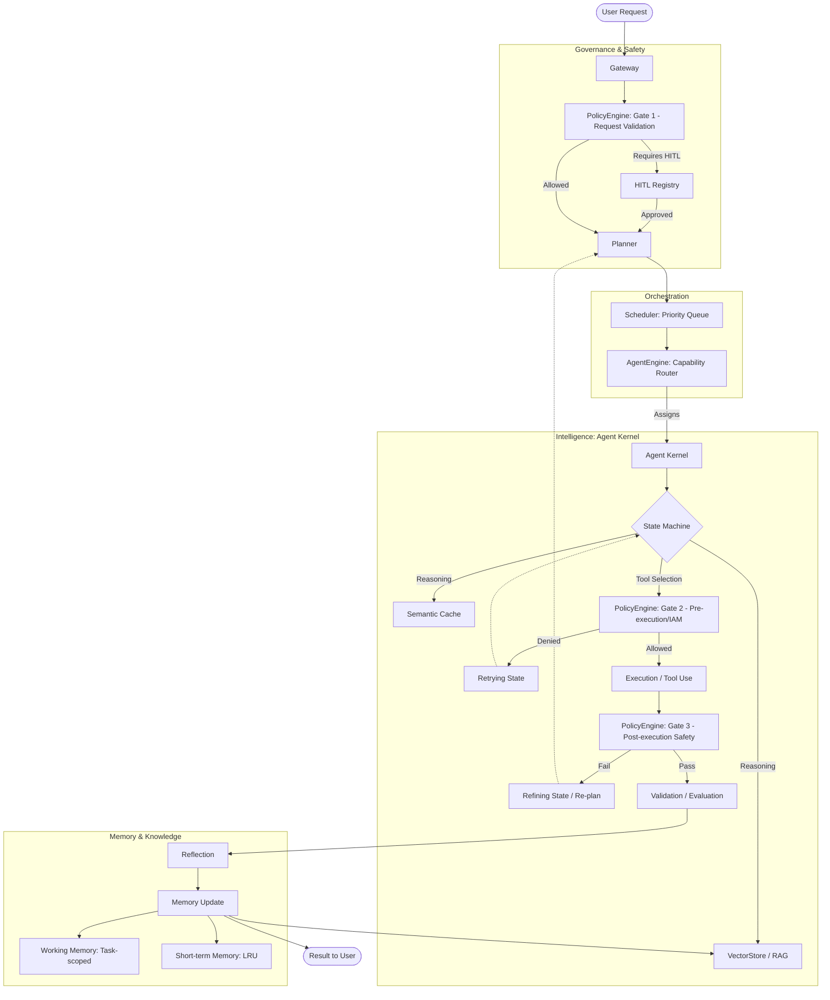

# AI-BOS: Proven Architecture & Educational Walkthrough

Welcome to the AI-BOS educational walkthrough. This guide visualizes and explains the core architectural components that have been **fully implemented and verified** by our test suite (39/39 passing).

Think of this as a map of a living "Operating System" designed to orchestrate autonomous agents with enterprise-grade governance and efficiency.

### 1. The Architectural Map (Proven Flow)

This diagram shows the journey of a user request through the system. Solid lines represent proven, tested paths.

---

### 2. Educational Walkthrough & Mentoring Guidance

For each layer, I’ve provided a mentoring-style breakdown of why it exists, why it's valuable, and how a professional implementation looks.

#### A. The Gateway (The Front Door)
*   **Purpose:** The entry point for all tasks. It manages traffic and establishes traceability.
*   **Proven Features:** TraceId generation, Session-based Rate Limiting (5 req/min).
*   **Mentoring Hint:**
    *   *Value:* Without a Gateway, you cannot track a request's lifecycle across distributed agents. Rate limiting prevents "infinite agent loops" from consuming your entire LLM budget.
    *   *Implementation:* A legitimate Gateway should be "dumb" regarding logic but "smart" regarding metadata. It should never process a task; only tag it and enforce environmental constraints.

#### B. The Policy Engine (The Guardrails)
*   **Purpose:** Implements "Three-Gate Validation" (Request, Pre-execution, Post-execution).
*   **Proven Features:** Risk assessment scoring, IAM role-based access control, sensitive data scanning.
*   **Mentoring Hint:**
    *   *Value:* This is the difference between a toy and a business tool. It ensures agents don't hallucinate administrative commands or leak PII (Personally Identifiable Information).
    *   *Implementation:* Use a "deny-by-default" strategy. Gates should be decoupled from the Agent Kernel so they can be updated or replaced without breaking the agent's reasoning logic.

#### C. The Orchestration Layer (The Conductor)
*   **Purpose:** Manages task priority and matches tasks to the best available agent.
*   **Proven Features:** Binary Heap-based Priority Queue, Capability-based routing, Task cancellation.
*   **Mentoring Hint:**
    *   *Value:* A simple array is fine for 10 tasks, but you need an (\log N)$ Priority Queue for 10,000. Capability routing ensures your "Financial Agent" handles the ledger, not your "Slack Connector."
    *   *Implementation:* High-performance orchestrators should be event-driven. Instead of polling for tasks, the `AgentEngine` should "watch" the `Scheduler` via the `EventBus`.

#### D. The Agent Kernel (The Brain)
*   **Purpose:** The execution engine for an individual agent. It follows a strict 11-step lifecycle.
*   **Proven Features:** Lifecycle state machine, `Retrying` and `Refining` feedback loops, Semantic Cache integration.
*   **Mentoring Hint:**
    *   *Value:* The state machine provides predictability. If an agent fails, the `Refining` loop allows it to realize "My plan was bad" and go back to the drawing board rather than just repeating the same mistake.
    *   *Implementation:* Never use `any` in your kernel. A legitimate implementation uses strict interfaces for `IPlanner` and `IReasoner` so you can swap model providers (e.g., GPT-4 to Gemini) without changing a single line of execution code.

#### E. Knowledge & Memory (The Library)
*   **Purpose:** Manages how an agent learns and remembers.
*   **Proven Features:** Pre-normalized `VectorStore` (30% faster search), Tiered memory (Working, Short-term, Long-term).
*   **Mentoring Hint:**
    *   *Value:* `WorkingMemory` is for the current task; `LongTermMemory` is for the organization's history. Pre-normalizing vectors during the `add` operation (instead of during `search`) is a critical performance win for large knowledge bases.
    *   *Implementation:* Short-term memory must have an eviction policy (like LRU). Otherwise, you will eventually overflow the LLM's context window with irrelevant history.

### 3. Summary of "Proven" (Passing) Components
| Layer | Component | Tested Logic |
| :--- | :--- | :--- |
| **Gateway** | `Gateway.ts` | TraceId propagation & Rate limiting |
| **Governance** | `PolicyEngine.ts` | 3-Gate Validation & IAM checks |
| **Orchestration** | `Scheduler.ts` | Priority-based execution & Cancellation |
| **Intelligence** | `AgentKernel.ts` | 11-step State Machine & Feedback Loops |
| **Knowledge** | `VectorStore.ts` | Optimized Dot-Product Semantic Search |
| **Optimization**| `SemanticCache.ts`| Cache-hit logic for reasoning results |
